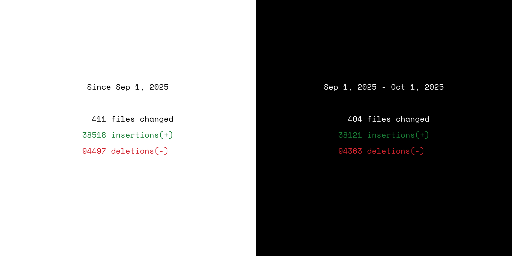

# GitBrag

A command-line tool to share your commit stats from local git repositories.




## Installation

#### MacOS - Homebrew

```bash
brew tap radulucut/gitbrag
brew install gitbrag
```

#### Windows - Scoop

```bash
scoop bucket add gitbrag https://github.com/radulucut/scoop-gitbrag
scoop install gitbrag
```

#### From source

```bash
go run main.go
```

#### Binary

Download the latest binary from the [releases](https://github.com/radulucut/gitbrag/releases) page.

## Usage

## Usage

```sh
gitbrag ./ --since '2025-01-01' --author 'john@example.com' -O stats.png -B 000 -C fff
```

#### Filter by date range

```sh
gitbrag ./ --since 2024-01-01
gitbrag ./ --since 2024-01-01 --until 2024-12-31
gitbrag ./ --since 7d
```

#### Filter by author name or email

```sh
gitbrag ./ --author "John Doe"
gitbrag ./ --since 7d --author john@example.com
```

#### Output statistics to PNG file

```sh
gitbrag ./ -O stats.png
gitbrag ./ --output stats.png --background "#282a36"
```

#### Use custom background and foreground colors

```sh
gitbrag ./ -O stats.png -B fff
gitbrag ./ -O stats.png --color "#50fa7b"
gitbrag ./ -O stats.png -B "#282a36" -C "f8f8f2"
gitbrag ./ -O stats.png -B 000 --color fff
```

#### Help

```bash
gitbrag --help
```
