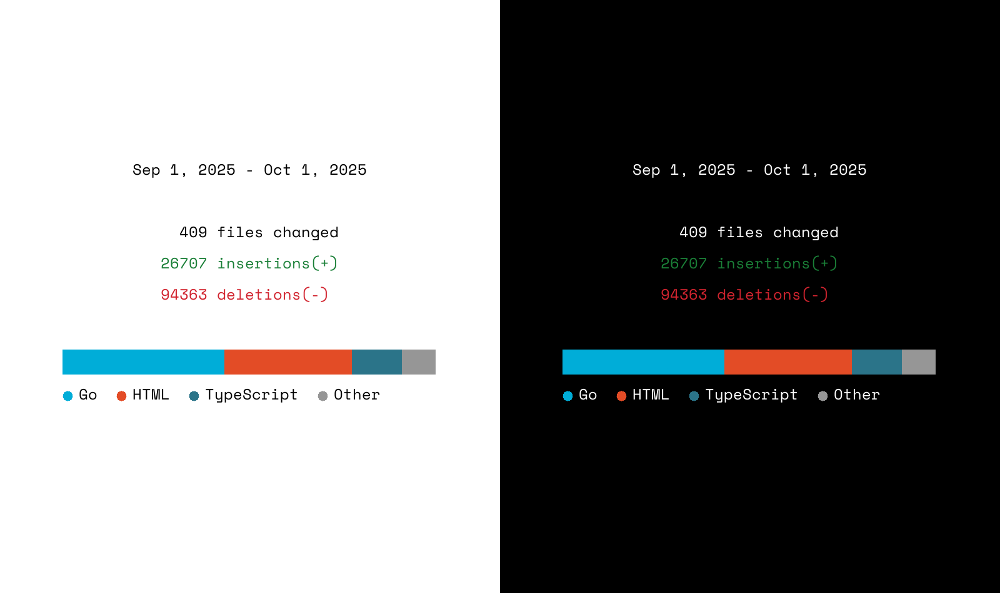

# GitBrag

A command-line tool to share your commit stats from local git repositories.




## Installation

#### MacOS - Homebrew

```bash
brew tap radulucut/gitbrag
brew install gitbrag
```

#### Windows - Scoop

```bash
scoop bucket add gitbrag https://github.com/radulucut/scoop-gitbrag
scoop install gitbrag
```

#### From source

```bash
go run main.go
```

#### Binary

Download the latest binary from the [releases](https://github.com/radulucut/gitbrag/releases) page.

## Usage

## Usage

```sh
gitbrag ./ --since '2025-01-01' --author 'john@example.com' -O stats.png -B 000 -C fff
gitbrag ./ --since '2025-09-01' --until '2025-10-01' -O stats.png -B fff -C 000 --lang --exclude-files '.*package-lock.json$'
```

#### Filter by date range

```sh
gitbrag ./ --since 2024-01-01
gitbrag ./ --since 2024-01-01 --until 2024-12-31
gitbrag ./ --since 7d
```

#### Filter by author name or email

```sh
gitbrag ./ --author "John Doe"
gitbrag ./ --since 7d --author john@example.com
```

#### Output statistics to PNG file

```sh
gitbrag ./ -O stats.png
gitbrag ./ --output stats.png --background "#282a36"
```

#### Use custom background and foreground colors

```sh
gitbrag ./ -O stats.png -B fff
gitbrag ./ -O stats.png --color "#50fa7b"
gitbrag ./ -O stats.png -B "#282a36" -C "f8f8f2"
gitbrag ./ -O stats.png -B 000 --color fff
```

#### Show language breakdown

```sh
gitbrag ./ -O stats.png --lang
gitbrag ./ -O stats.png --lang -B "#282a36" -C "f8f8f2"
```

The `--lang` flag adds a visual bar chart showing the percentage breakdown of your top 3 programming languages plus an "Others" category. Each language is displayed with its representative color and percentage. This feature only works with PNG output (`-O` flag).

#### Exclude files matching regex pattern

```sh
gitbrag ./ --exclude-files '.*\.lock$'
gitbrag ./ --exclude-files 'package-lock\.json'
```

The `--exclude-files` flag accepts a regular expression (https://github.com/google/re2/wiki/Syntax) pattern to exclude files from the statistics. This is useful for ignoring lock files, dependencies, or any other files you don't want to include in your commit stats.

#### Exclude directories matching regex pattern

```sh
gitbrag ./ --exclude-dirs 'node_modules|vendor'
gitbrag ./ --exclude-dirs '.*test.*'
```

The `--exclude-dirs` flag accepts a regular expression (https://github.com/google/re2/wiki/Syntax) pattern to exclude directories when scanning for git repositories. This is useful for skipping large dependency directories like `node_modules` or `vendor`, or excluding test directories. The pattern matches against directory names, not full paths.

#### Help

```bash
gitbrag --help
```
